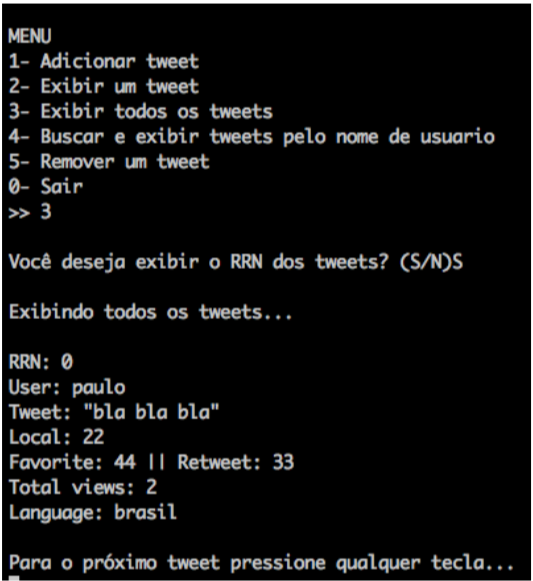

# Tweets

OVERVIEW
--------------------------------------------------
The purpose of this project was to implement an application in C language that can Add, Remove and Search within a Database for the [File Structure Organization] course. It was made at the Computer Science undergraduate program from University of São Paulo (ICMC - USP).

PROJECT
--------------------------------------------------
Basically there is a Tweet database with the following file organization strucutre:
* fixed-length fields (in bytes)
* fixed-register size (in bytes)

You can Add, Remove (Logical Remove) and Search (Relative Record Number Search) within the database.


TWEET FILE  STRUCTURE
--------------------------------------------------
```bash
TEXT (tweet text – char)
USER (username – char)
COORDINATES (User Coordinates – char)
FAVORITE_COUNT (Number of times a tweet has been marked as favorite  –  int)
LANGUAGE (Language – char)
RETWEET_COUNT (Number of retweets – int)
VIEWS_COUNT (Number of tweet views – long)
```

EXAMPLE
--------------------------------------------------


HOW TO COMPILE
--------------------------------------------------
Just use the makefile:

```bash
	make
	make run
```

CREDITS
--------------------------------------------------
- Aulos Plautius Martines Marino
- Paulo Guarnier De Mitri
- Werik Amaral Fachim
- Wesley Tiozzo

MORE INFO
--------------------------------------------------
* Please check the files `project specification.pdf` and `project report.pdf` to view the code and know more about this project.
